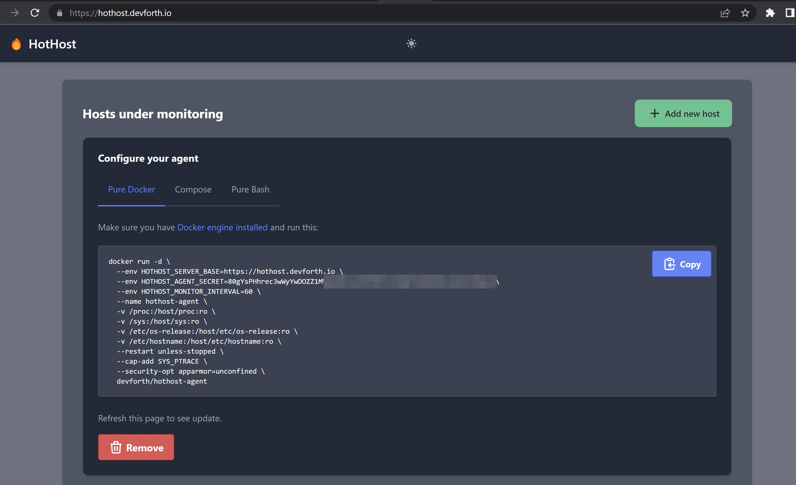

# HotHost

Lightweight and minimalistic Open-Source hosts monitor. 

* Shows used disk space percentage and ALERT badge if it exceeds some threshold (e.g. 80%)
* Shows used RAM percentage and ALERT badge if it exceeds some threshold (e.g. 80%)
* Allows to setup Email/Slack/Telegram notifications
* Agents could be easily installed with Docker/Compose/Bash+curl+crontab. Super simple snippets are shown when you click one button on Web
* Allows to monitor as many servers as needed
* Configurable monitoring interval
* Based on alpine minimalistic Docker images
* You can add a public page protected with Basic Auth to watch status with some external monitor (e.g. UptimeRobot can trigger own notifications when there is a ALERT keyword on page)

For each host it allows to see:

* OS version
* CPU model
* RAM size and current RAM ussage
* See whether SWAP is enabled and whether it is used

# Preview


Add new host form:



Available plugins:


# Installation

First you need to run HotHost Web Server. It will then give you clear guide how to add agents. 
You can use any host with public IP. You are responsible for setting up SSL. 

You can use one of next options:
- Nginx or traefik with connected external certificate or free Let's Encrypt certificate
- Free Cloudflare CDN which terminates SSL and gives additional layer of cecurity.


# Web Server

## Docker Compose

First setup HotHost Web, for example to add it into existing compose stack:

```
version: '3.5'

services:
  hothost-web:
    image: devforth/hothost-web
    environment:
      - HOTHOST_WEB_ADMIN_USERNAME=admin
      - HOTHOST_WEB_ADMIN_PASSWORD=!!!CHANGE_ME!!!
      - HOTHOST_WEB_PORT=8007
    ports:
      - 8007:8007
    volumes:
      - v-hothost-data:/var/lib/hothost/data/
volumes:
  v-hothost-data:
```

Now you should proxy https://subdomain.yourdomain.com to serve requests from 127.0.0.1:8007.

* Use https://subdomain.yourdomain.com to view as admin and add new agents


Example Nginx Proxy:

```
server {
  listen 443;
  server_name subdomain.yourdomain.com;
  ssl_certificate     wildcard.crt;
  ssl_certificate_key   wildcard.key;

  charset utf-8;
  client_max_body_size 75M;

  gzip on;
  gzip_disable "msie6";
  gzip_vary on;
  gzip_proxied any;
  gzip_comp_level 8;
  gzip_buffers 16 8k;
  gzip_http_version 1.1;
  gzip_min_length 256;
  gzip_types text/plain text/css application/json application/x-javascript text/xml application/xml application/xml+rss text/javascript application/vnd.ms-fontobject application/x-font-ttf font/opentype image/svg+xml image/x-icon;

  location / {
      proxy_read_timeout 220s;
      proxy_set_header X-Forwarded-For $proxy_add_x_forwarded_for;
      proxy_set_header Host $http_host;
      proxy_redirect off;
      proxy_pass http://127.0.0.1:8007;
  }
}
```


## Pure Docker

In case if you want to use pure docker:

```
mkdir -p /www/hothostdata
docker run -d --name=hothost-web \
  -v /www/hothostdata:/var/lib/hothost/data/  \
  --env HOTHOST_WEB_ADMIN_USERNAME=admin  \
  --env HOTHOST_WEB_ADMIN_PASSWORD=!!!CHANGE_ME!!!  \
  --restart=always  \
  --env HOTHOST_WEB_PORT=8007  \
  -p 8007:8007  \
  devforth/hothost-web
```


# Updating Web

```
docker pull devforth/hothost-web:latest
```

then recreate a contaner

# Optional Environment variables

If you want to create a public page with Basic Auth access, then provide next two environment variables to web:

* HOTHOST_WEB_BASIC_PUBLIC_USERNAME
* HOTHOST_WEB_BASIC_PUBLIC_PASSWORD

Then use https://subdomain.yourdomain.com/public/ with basic auth credentials. You can add this to setup e.g. UptimeRobot monitor and watch for `WARNING` keyword to prevent disk space issues

# Plugin development

Every plugin is a standalone .js of ESM format (with exports/imports, CommonJS with require is not supported). File should have a defined structure. Use `server/src/plugins/slack.js` for a Hello-World example. It is well documented

Currently plugin file should be placed into `server/src/plugins` directory.

If you want to bundle some dedicated node modules then you need to compile them using webpack or other bundler which supports ESM outputs. Please see `server/src/plugins/gmail.src/gmail.src.js` - it bundels node-mailer into plugin.


# Development


Default local credentials:
- admin:123456

How to run:
- Apply migrations using: `npm run migrate`
- Run the server using: `npm start`
